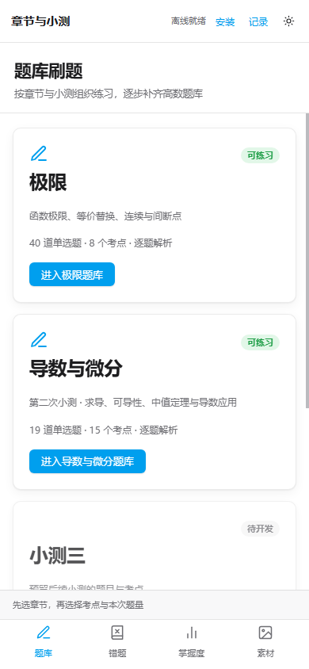
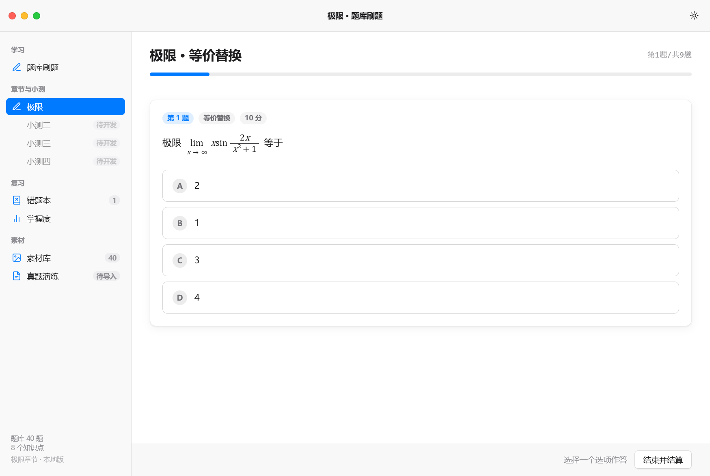

# Advanced Mathematics / Calculus Quiz Platform

高等数学离线题库桌面应用。按章节与考点练习，提供逐题解析、错题复习和学习记录备份。

手机版：**v0.3.0 PWA**；Windows 便携版：**v0.2.0**。已开放 **极限章节：40 道单选题、40 份解析、8 个考点**。

## 手机版

[打开手机 PWA](https://Aminoshaha.github.io/advanced-mathematics-calculus-quiz-platform/)。Android 可从页面或浏览器菜单安装，iPhone 可用 Safari 的分享菜单添加到主屏幕。首次打开请等待“离线就绪”，之后支持离线刷题。

手机界面按原小测布局设计，包含答题卡、上一题回看、作答得分、解析与固定切题按钮，刷新后可继续未结算练习。手机与电脑分别保存记录，可用备份文件转移。详见 [PWA 使用与部署](docs/PWA.md)。

## 下载与使用

从 [Releases](https://github.com/Aminoshaha/advanced-mathematics-calculus-quiz-platform/releases) 下载桌面便携版，完整解压后双击 `高等数学题库.exe`。不要只复制 exe，旁边的资源文件需完整保留。

- Windows 10/11 x64。
- .NET Framework 4.6.2 或更新版本。
- Microsoft Edge WebView2 运行时；Windows 11 通常已预装。
- 日常使用无需 Python、命令行或网络。

## 功能

- 章节首页：现有题库归入“极限”，预留“小测二、三、四”。
- 考点筛选：选定部分考点默认限额 10 题；不足 10 题时使用实际可用题量，可自定义数量。
- 全量练习：“不限”表示当前范围全部题目各刷一次，全题库为 40 题，不循环补题。
- 精确进度：显示“第1题/共10题”等实际进度，最后一题答完自动结算。
- 逐题即时或整组延迟反馈、分步解析、原题截图核对。
- 错题重刷、知识点掌握度、Markdown 错题本导出。
- 深浅色外观、键盘作答、学习记录备份与恢复。





## 当前范围

目前只包含极限章节。AI 自动出题、OCR、主观题判分及正式真题演练尚未实现。后续小测入口处于待开发状态。

## 学习记录

记录保存于 `%LOCALAPPDATA%\GaoshuBank\Desktop`，不写入源码目录，不随 Git 上传。顶部“学习数据”菜单可备份与恢复记录。未结算练习在关闭前会提醒，完整历史需结算后保存。

## 从源码构建

桌面宿主使用 Windows Forms 与微软官方 WebView2 SDK，网页使用原生 HTML/CSS/JavaScript，无 npm 构建或 CDN 依赖。

在 Windows PowerShell 中执行：

```powershell
./desktop/fetch-sdk.ps1
./desktop/build.ps1
```

构建结果位于 `dist/高等数学题库-桌面版/`。首次获取 SDK 需要联网；构建使用 Windows 自带的 .NET Framework 编译器。运行题库无需联网。

网页开发预览可执行：

```powershell
python web/serve.py
```

## 验证

网页回归检查：

```powershell
cd web
python build.py
node tools/links-check.mjs
node tools/tex-check.mjs
node tools/render-check.mjs
python tools/scan-latex.py
```

桌面实际验收：

```powershell
& './dist/高等数学题库-桌面版/高等数学题库.exe' --self-test "$PWD/qa"
```

验收使用隔离记录，生成 `result.json` 和真实页面截图。v0.2.0 已在 Windows 11 + WebView2 154 环境通过 122 项桌面检查；网页流程 31 项通过，公式渲染 568 项无异常。

## 项目结构

```text
desktop/      Windows 桌面宿主、构建与验收工具
web/          界面、题库、解析、原题图片与回归检查
docs/         产品设计与界面截图
exe/          旧 Python 启动器，保留作为历史实现
materials/    后续试卷素材规范
dist/         本机构建产物，不提交 Git
```

## 第三方组件

WebView2 SDK 由 Microsoft 提供，其许可证与 NOTICE 保留在 `desktop/licenses/`，随桌面便携版分发。仓库尚未选定项目整体开源许可证；代码、题库及原题素材的授权范围不由微软组件许可证覆盖。
